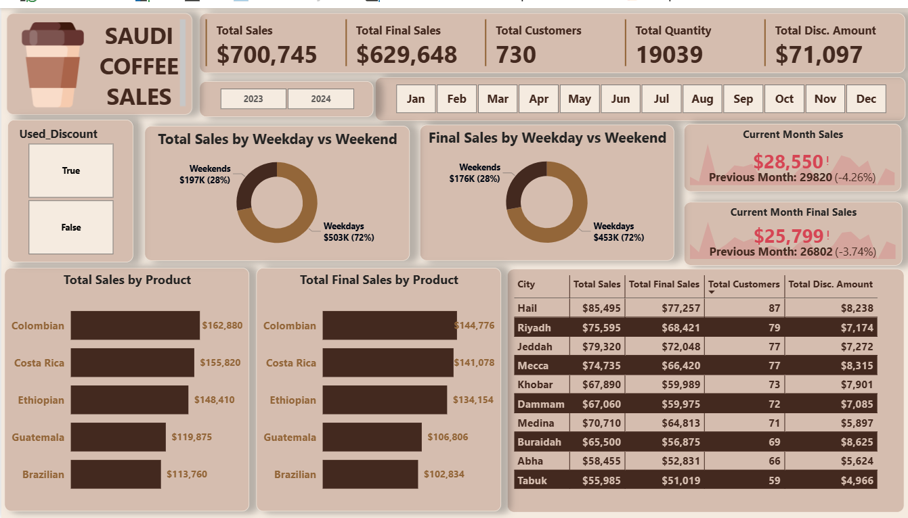

# Saudi Coffee Sales Analytics Dashboard

## Project Overview
This project is a **PowerBi-based Analysis Dashboard** that provides a **high-level overview of Coffee sales, discount Usage and Sales trends over time**
This dashboard is design to help manager to improve sales, pricing, inventory and customer experience.

---

## Objectives
- To evalautes the difference between total sales and final sales across different cities and over time, providing insights for business decision.
- To understand customer's preferences for different products
- Track Sales trends
- Identify top city with the highest number of customers and sales and the products with the highest sales

---

## Key Metrics (KPIs)
- **Total Sales:** $700,745
- **Total Final Sales:** $629,648
- **Total Customers:** 730
- **Total Quantity:** 19039
- **Total Discount Amount:** $71,097

---

## Data Cleaning and Transformation
All data preparation was perform using **Power Query in PowerBi**, icluding:
- Remove duplicate and handling missing values
- Standardizing column name and data formats
- Creating calculated columns
- Transforming raw data into a analyzing-ready tables

---

 ## Data Analysis
 Analysis was carried out using DAX to enable:
 - Total sales and Final Sales across products and time dimensions
 - Customer analysis based on discount usage
 - Sales and number of customers breakdown by city

---

  ## Data Visualization
  Insights are visualized using **Build Visual** to communicate trends and patterns:
  - Donut chart for Customer distribution by discount usage, while Total sales and Final sales were visulaized across time dimensions(weekdays and weekends)
  - Bar chart Column chart was used to visualize product distribution across Total sales and Final sales
  - Tables were used display total sales, final sales, customer distribution and discount usage across different cities
  - Slicer was used to display data by months and years
    
---

## Dataset Description
The datasets includes:
- Customers demographics
- Products and City details
- Sales, quantity and discount amount
- KPI was used to track month-over-month changes in total sales and final sales

---

## Key Insights
- Even with discount applied, total sales decreased from $700,745(no discount) to $629,648(with discount)
which shows the discount did not show a postive impact on revenue.
- Customers may have been motivated by factor like product quality other than discounts
  
---

## Dashboard Preview

---

## Recommendation:
- Revert discount sales and improve product quality and consistency
- Focus more on **Normal Sales** strategies to maximize revenue
- Consider loyalty program and rewards which will encourage regular visits and create long term customer loyalty

  *Datasets used for learning and Analytical purpose*
